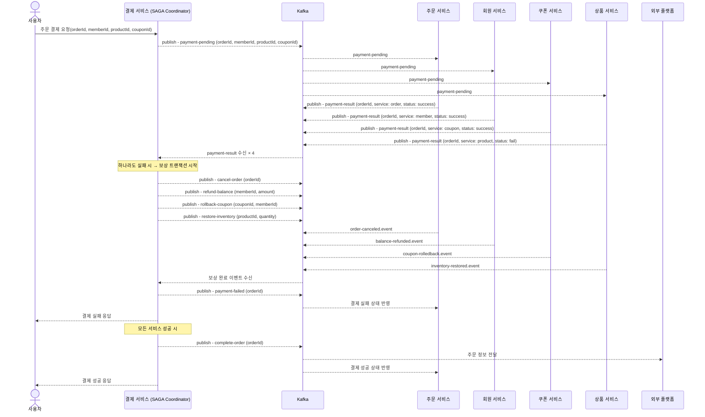

# STEP16 Facade 패턴의 MSA 전환의 필요성과 전환을 위한 설계 및 방안 제시

## 1. 문제 상황 인지

최근 사용자 증가와 서비스 고도화로 인해 시스템 전체에 점진적인 부하 증가가 발생하고 있으며, 특히 주문 및 결제 처리 과정에서 데이터베이스 및 서비스 간 호출의 부하가 집중되고 있습니다.
이에 따라 향후에는 서비스별 데이터베이스 분리 및 독립적인 스케일링을 통한 리소스 최적화가 필수적으로 요구되는 상황입니다.

이러한 요구에 대응하기 위해서는 마이크로 서비스(MSA)로의 전환이 필요합니다. MSA 구조에서는 각 도메인을 독립적인 서비스로 분리하여, 트래픽 양에 따라 유연하게 확장하거나 장애를 격리할 수 있어 성능, 유지보수성, 배포 효율성을 향상시킬 수 있습니다.

하지만 현제 결제 도메인은 결제 처리 과정에서 회원, 쿠폰, 상품, 주문 도메인에 대한 조회 및 수정 작업을 수행하고 있으며, 이름 위해 Facade 패턴을 활용해 각 도메인에 강하게 의존하고 있습니다.
이러한 구조는 도메인 간 결합도를 높이고 있으며, MSA 구조로의 전환을 어렵게 만들고 있습니다. 실제로 서비스를 분리하지 않는 이상, 단일 서버 환경에서만 안정적으로 운영 가능한 구조라는 제약이 따릅니다.

또한 도메인별 트래픽 규모를 살펴보면, 상품→주문→결제 순으로 사용량이 점차 감소하는 경향이 있으며, 전체 상품 중 일부만 주문되고, 그 중 일부만 결제까지 이어지기 때문에 결제 도메인의 상대적 규모는 작습니다.
그럼에도 불구하고 결제 도메인이 주문 및 상품 도메인과 직접 연결되어 있는 현재 구조는 불필요한 리소스 결합과 전체 시스템 확장성 저해로 이어지고 있습니다.

따라서 이러한 구조적 문제를 해소하고 확장 가능하고 유연한 시스템을 만들기 위해서는 도메인 간 직접 호출을 제거하고 Kafka 등 메시지 브로커를 기반으로 한 이벤트 기반 비동기 통신으로 전환함으로써 결제 도메인의 독립성과 확장성을 확보해야 합니다.

---

## 2. 해결 방안 개요

MSA로 전환하면서 도메인 간 결합도를 낮추고 독립적인 서비스 운영을 실현하기 위해 다음과 같은 방안을 고려한다.

- Kafka 기반 메시징 시스템 도입: 서비스 간 동기 호출 대신 Kafka를 통해 비동기 이벤트 기반 통신으로 전환
- 도메인 분리와 서비스 경계 명확화: 각 도메인을 개별 서비스로 나누고, 이벤트를 통해 상태 전달
- 트랜잭션 일관성 확보를 위해 SAGA 패턴 도입: 분산 환경에서의 일관성과 오류 복구를 위한 보상 트랜잭션 설계

---

## 3. 배포 단위 설계

### 3-1. 배포 단위를 분리 시 기준

1. 도메인 중심 분리 (DDD 기반)
    
    기준:
    
    - 업무적으로 독립적인 Bounded Context 가 명확한 경우
    - 예: 회원, 결제, 주문, 상품 등
    
    장점:
    
    - 팀 구조와도 매핑 가능 (Team-Context Alignment)
    - 변경 영향도가 작고 유연한 확장 가능
    
    실전 판단 질문:
    
    - “이 기능은 다른 기능 없이 독립적으로 동작할 수 있는가?”
    - “이 기능은 다른 도메인의 변경에 민감하게 반응하는가?”
2. 데이터 일관성 요구도
    
    기준:
    
    - 강한 일관성이 필요한 도메인은 동일 서비스로 묶고,
    - eventual consistency로 괜찮은 경우 분리 가능
    
    예시:
    
    - 재고 차감과 결제 처리는 서로 eventual consistency로 가능 → 분리 가능
    - 상품 가격 변경과 할인 정책은 함계 일관성이 필요 → 하나로 묶는게 안전
3. 배포 빈도/변경 주기
    
    기준: 
    
    - 변경 주기가 잦은 기능은 분리
    - 예: 마케팅 배너, 쿠폰 서비스는 자주 바뀌므로 핵심 주문 도메인과 분리
    
    실전 판단 질문:
    
    - “이 기능은 얼마나 자주 변경되나?”
    - “변경 시 다른 기능을 자주 깨뜨리진 않는가?”
4. 확장성과 성능 특성
    
    기준:
    
    - 트래픽 성격이나 부하 패턴이 다른 경우 분리
    
    예시:
    
    - 주문 API는 낮은 TPS, 상품 조회 API는 높은 TPS → 별도 인스턴스로 분리
    - 알림 서비스는 비동기 처리로 큐 기반 마이크로서비스로 분리
5. 보안/인증 경계
    
    기준:
    
    - 민감한 도메인 (예: 결제, 회원정보)은 독립 서비스로 보호
    - 인증/인가가 분리돼야 하면 Auth 서비스를 별도 운영

### 3-2. 배포 단위를 분리하지 말아야 할 기준

| 잘못된 기준 | 이유 |
| --- | --- |
| 개발자 개인 담당 기능 | 협업 및 유지보수 어려움 |
| 단순 CRUD 수준 | 마이크로서비스 분리보다 모노리스 유지가 나음 |
| 기술 스택이 다르다는 이유 | 도메인 중심이 아니라 기술 중심 분리는 오히려 복잡도만 증가 |

### 3-3. 현 도메인 분석

| 서비스 | 분리 기준 |
| --- | --- |
| Member 서비스 | Bounded Context |
| Order 서비스 | 결제/상품 등과 트랜잭션 일관성 없음 |
| Payment 서비스 | 결제와 높은 연관, 외부 서비스 연계 가능성 있음 |
| Product 서비스 | 트래픽 큼 + 단독 조회 많음 |
| Coupon 서비스 | 자주 바뀜 + 캐시 전략 별도 |
| 인기 상품 서비스 | 캐시 전략 별도 |
| Notification | 비동기 처리, 고성능 요구됨 |

### 3-4. 서비스별 분리 전략

| 서비스 | 분리 수준 | 분리 이유 / 고려사항 |
| --- | --- | --- |
| **Member 서비스** | ✅ **완전 분리** | Bounded Context 명확 (회원 정보, 잔액 등 독립적), 인증/인가 분리 가능성 |
| **Order 서비스** | ✅ **완전 분리** | 결제/상품과 트랜잭션 일관성 없음, 상태 기반 처리 (SAGA 중심), 상태 변경 이벤트 발행자로 위치 |
| **Payment 서비스** | ✅ **완전 분리 (외부 연계 고려)** | 외부 PG사 연동 가능성 높음, 결제 로직 고유, 신뢰성/보안 요구도 높음, 실패 보상 필요 |
| **Product 서비스** | ✅ **완전 분리** | 트래픽 크고 Read/Write 비율 다름, 인기 상품 분리도 가능, 캐시 전략 특화 |
| **Coupon 서비스** | ✅ **완전 분리** | 발급/사용 로직이 독립적이고 정책 변경 빈번, TTL/캐시 고려로 인프라 설정이 다름 |
| **인기 상품 서비스** | ⚠️ **Product 하위 혹은 Read-Only 서비스 분리** | 캐시 중심 단독 읽기 서비스, 통계 기반 → Product에서 서브로 분리 or view-service 구성 가능 |
| **Notification 서비스** | ✅ **완전 분리 (비동기 처리)** | 메일, 메시지, 알림 큐 기반 처리, 고성능 요구, 다른 서비스들과 동기 흐름 없음 |

### 3-5. 아키텍처 구조

```
[API Gateway] → 인증/라우팅/역할 기반 접근 제어
 ├── member-service
 ├── order-service
 ├── payment-service
 ├── product-service
 │     └── popular-product-service (or 캐시뷰 Read-only 서비스)
 ├── coupon-service
 └── notification-service
```

### 3-6. 서비스 간 책임과 경계

| 서비스 | 책임 | 호출 or 이벤트 기반 |
| --- | --- | --- |
| Member | 잔액 관리, 회원 정보 | 이벤트 기반 잔액 차감/복원 |
| Order | 주문 상태 관리 | 이벤트 기반 상태 전이 |
| Payment | 결제 로직 제어 및 외부 연계 | 중앙 Orchestrator 역할 (SAGA Coordinator) |
| Product | 상품 정보, 재고 차감 | 이벤트 기반 or API 호출 |
| Coupon | 쿠폰 검증/사용 처리 | 이벤트 기반 사용 및 복구 |
| PopularProduct | 인기 상품 집계/조회 | Redis, Kafka Consumer 기반 집계 캐시 |
| Notification | 메시지 발송 | Kafka 기반 비동기 구독 |

---

## 4. Kafka의 도입 개요

Kafka는 고성능 분산 스트리밍 플랫폼으로, 발행-구독(Pub/Sub) 방식의 메시지 브로커 역학을 합니다. 수많은 프로듀서(Producer)와 컨슈머(Consumer)가 동시에 메시지를 송수신할 수 있으며, 메시지는 토픽 단위로 구성되어 분산 저장됩니다.

Kafka는 다음과 같은 이유로 도입됩니다:

- 마이크로서비스 간 비동기 이벤트 통신
- 서비스 간 결합도 최소화
- 고가용성과 장애 허용
- 대량 데이터 처리 성능 확보

Kafka를 도입함으로써 서비스 간 직접 호출을 없애고, 메시지 중심의 유연한 아키텍처를 실현할 수 있습니다.

---

## 5. Kafka 기반 메시징 구조 설계

PaymentFacade 를 기준으로 구조 설계 변경의 핵심을 파악한다.
Kafka를 도입하여 도메인 간 호출을 이벤트 발행 및 구독 기반으로 전환한다. 결제 도메인은 다음과 같은 이벤트를 통해 흐름을 제어한다.

- payment-pending → 결제 진행 이벤트 발행
- payment-pending 이벤트를 받은 각 도메인들은 각자의 책임을 다하고 완료 시 payment-result 메시지를 발행

---

## 6. 보상 트랜잭션 및 SAGA 패턴 적용

MSA 구조에서는 분산 트랜잭션이 불가능하므로, 트랜잭션 실패 시를 고려한 보상 트랜잭션 설계가 필요합니다.

### SAGA 패턴이란?

- 분산된 여러 서비스에서 각각의 로컬 트랜잭션을 실행하고, 중간에 실패가 발생할 경우 앞서 수행된 작업을 보상하는 방식으로 일관성을 유지하는 트랜잭션 패턴
- MSA에서 분산 트랜잭션을 관리하기 위한 패턴이며, 각 서비스는 자신의 로컬 트랜잭션만 수행하고, 전체 트랜잭션의 성공 여부는 서비스 간 메시지를 통해 협력적으로 결정

### SAGA의 핵심:

- 성공 시 다음 서비스에 메시지를 전달
- 실패 시 보상 트랜잭션 실행

### SAGA 패턴 적용 흐름 예시:

- 결제 성공 시 → 회원 잔액 차감, 상품 재고 차감, 주문 상태 변경 수행
- 상품 재고 차감 실패 시 → 회원 잔액 환불, 주문 롤백 등 보상 트랜잭션 수행

### 보상 이벤트 예시:

- refund-balance.command
- revert-order.command
- rollback-coupon.command

각 보상 트랜잭션은 멱등성을 가지도록 설계되어야 하며, 중복 실행이나 네트워크 장애에도 안전하게 처리되어야 합니다.

### Choreography 와 Orchestration 방식의 비교

SAGA는 Orchestration 방식과 Choreography 방식으로 구현할 수 있으며, Kafka와 함께 사용할 경우 메시지 기반 트랜잭션 흐름을 안정적으로 관리할 수 있습니다.

| 구분 | Choreography | Orchestration |
| --- | --- | --- |
| 조율 주체 | 없음 (서비스 자율) | 중앙 Orchestrator (ex. 결제 서비스) |
| 흐름 제어 | 이벤트에 따라 흐름 전파 | 중앙에서 단계별 명령 발행 |
| 장점 | 확장성, 유연성 | 흐름 명확, 오류 대응 용이 |
| 단점 | 복잡한 흐름 추적 어려움 | 단일 서비스에 책임 집중 |

PaymentFacade의 전환 시 두 방식의 혼합하여 하이브리드 방식으로 진행합니다.
주문 도메인에서 메시지 발행 시 각 서비스에서 필요한 비즈니스 로직을 수행하고 완료 시 메시지 발행을 통해 Redis 혹은 Common DB 에 결과를 기록합니다.
이를 주문 도메인에서 확인하다가 결과를 종합하여 성공,실패 여부를 판단하고 실패 시 보상 트랜잭션이 필요한 서비스에 메시지를 발행합니다.

---

## 7. PaymentFacade 의 SequenceDiagram (MSA ver)



- 동작 흐름
    - 주문 정보 수정 (상태: 결제 준비 중 → 결제 진행 중), payment-pending 이벤트 발행
    - 회원, 쿠폰, 상품 서비스에서 payment-pending 이벤트 수신 후 각자 비즈니스 로직 수행
    - 수행 결과를 payment-result 이벤트로 발행
    - 주문 서비스에서 payment-result 이벤트 수신 시 redis 에 저장
    - redis 에 4개의 이벤트 모두 수신 시, 결과를 확인
    - 1개라도 실패 시, 성공한 로직에 대해서 보상 트랜잭션 수행을 위한 이벤트 발행

---

## 8. Kafka의 활용 극대화를 위한 추가 논의점

### 8-1. Transactional Outbox 패턴의 필요성 및 개념

Transactional Outbox 패턴은 서비스가 데이터베이스에 데이터를 저장하는 동시에, Kafka와 같은 외부 메시지 시스템에 메시지를 안전하게 발행하기 위한 패턴입니다.

트랜잭션 내에서 비즈니스 데이터와 함께 Outbox 테이블에 메시지를 저장하고, 별도의 Dispatcher가 해당 메시지를 Kafka로 전송합니다.

필요성:

- 데이터 변경과 이벤트 발행의 원자성 보장
- 메시지 손실 방지
- Kafka 송신 실패 시에도 안전하게 재시도 가능

메시지 손실이 생기는 이유

- 카프카 메시지 발행 중 네트워크 장애 발생
이 경우 Kafka 에는 메시지가 전송되지 않아서 다른 서비스는 상태를 모름.

Outbox 패턴이 이를 해결하는 방법

- DB 갱신과 메시지 저장을 동일 트랜잭션으로 처리
- 실제 Kafka 전송은 비동기로 따로 처리
- Kafka 전송 실패 시에도 DB에는 메시지가 남아있기 때문에 다시 전송 가능

### 8-2. CDC (Change Data Capture)

CDC는 데이터베이스 변경 사항을 실시간으로 감지하여 외부 시스템에 전달하는 기술입니다. Debezium 같은 툴을 활용하면 Outbox 테이블의 변경 내용을 Kafka로 자동 전송할 수 있어 Outbox 패턴과 함께 자주 사용됩니다.

필요성:

- 서비스 코드 변경 없이 이벤트 발행 가능
- 데이터 흐름을 비동기로 연결

### 8-3. DLT (Dead Letter Topic)

DLT는 Kafka에서 메시지 소비 중 오류가 발생했을 때, 해당 메시지를 별도로 저장하는 토픽입니다.

필요성:

- 재처리가 어려운 메시지 식별 및 수동 검토
- 비정상 메시지로 인한 전체 소비 중단 방지
- 운영 안정성 확보

### 8-4. Throttling

Throttling은 시스템 과부화를 방지하기 위해 소비 속도 또는 호출 빈도를 제어하는 기술입니다. Kafka Consumer 또는 서비스 내부에서 처리량을 제한함으로써 부하를 조절할 수 있습니다.

필요성:

- 대량 트래픽 유입 시 서비스 보호
- 백프레셔(backpressure) 제어
- 시스템 안정성과 응답 속도 확보

<aside>
💡

이러한 기술 요소들은 Kafka 기반 MSA에서 안정성과 일관성을 확보하기 위한 핵심 설계 전략입니다.

</aside>

---

## 9. 결론

현재 시스템은 사용자의 증가와 함께 결제 처리 흐름에서 발생하는 트래픽 집중, 데이터 일관성 문제, 서비스 간 결합도 증가 등의 이슈를 안고 있으며, 이는 시스템 전체의 확장성과 안정성에 직접적인 영향을 미치고 있습니다. 특히 결제 도메인이 주문, 상품, 쿠폰, 회원 서비스에 직접 의존하고 있는 구조는 마이크로서비스 아키텍처(MSA)로의 전환을 어렵게 만들고 있습니다.

또한 서비스별 트래픽 양의 차이, 특히 상품 서비스의 조회 트래픽이 집중되거나 결제 요청이 특정 시간대에 몰리는 경우처럼, 시스템 부하가 특정 도메인에 집중되는 상황에서는 단일 시스템 구조로는 적절한 대응이 어려워집니다. 이러한 트래픽 및 부하 분산 문제에 효과적으로 대응하기 위해서는 서비스별로 독립적인 확장성과 처리 경로를 보장할 수 있는 구조가 요구됩니다.

이에 따라 본 보고서는 다음과 같은 핵심 해결 방안을 제시합니다:

- 도메인 간 직접 의존을 제거하고, Kafka 기반의 이벤트 중심 아키텍처로 전환
- 트랜잭션 정합성을 확보하기 위한 SAGA 패턴 도입과 보상 트랜잭션 설계
- 메시지 손실을 방지하기 위한 Transactional Outbox 패턴 적용 및 CDC 기반 메시지 발행 자동화
- 장애 대응 및 메시지 신뢰성 확보를 위한 DLT 사용
- 트래픽 급증에 대한 대응 전략으로 Throttling 설계 도입

이러한 전환을 통해 결제 도메인을 포함한 전체 시스템은 다음과 같은 효과를 기대할 수 있습니다:

- 서비스 간 결합도 감소로 인한 독립적 배포 및 장애 격리 가능
- 트래픽 특성에 맞는 유연한 확장 (예: 결제는 작게, 상품은 크게)
- 데이터 일관성 및 장애 대응력 향상
- 운영 효율성과 유지보수성 개선
- 급격한 사용량 증가나 피크 트래픽에도 안정적인 부하 분산 및 처리 가능

결론적으로, 본 Kafka 기반 MSA 구조는 단순한 기술 전환을 넘어 시스템의 확장성과 안정성, 그리고 비즈니스 변화 대응력을 동시에 확보하기 위한 핵심 전략입니다. 향후에는 각 서비스의 이벤트 흐름과 보상 트랜잭션을 체계적으로 모니터링하고, SAGA 상태 추적 시스템 및 Outbox 메시지 처리 모듈을 고도화함으로써 더욱 견고한 마이크로서비스 기반 결제 시스템을 구현할 수 있을 것입니다.