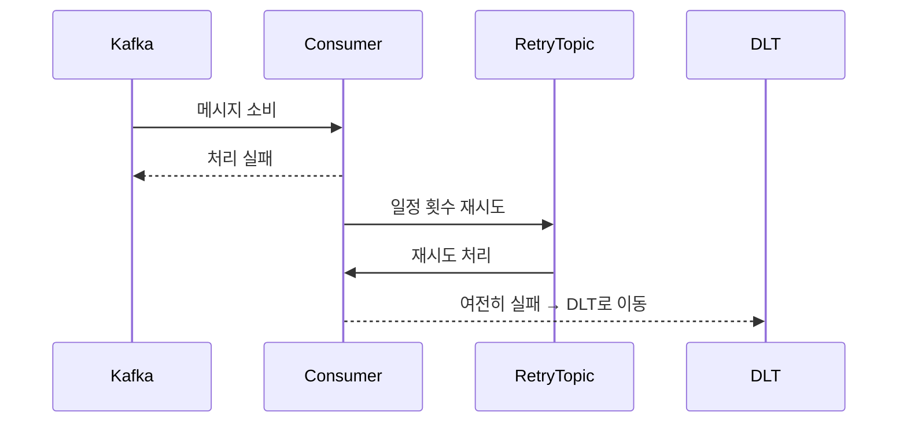
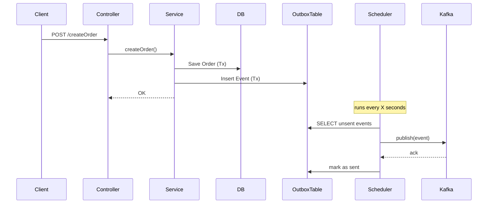

# STEP17 카프카 학습 노트

## 1. Kafka 개요

### 1-1. Kafka란 무엇인가?

Apache Kafka는 분산 스트리밍 플랫폼으로, 실시간 데이터 파이프라인 구축과 스트림 처리에 최적화된 메시지 브로커입니다. LinkedIn에서 시작되어 현재는 Apache Software Foundation에서 관리하고 있습니다.

### 1-2. Kafka의 주요 특징

- `높은 처리량`: 초당 수백만 건의 메시지 처리 가능
- `내구성`: 디스크에 로그 형태로 데이터 저장 및 복제
- `확장성`: 브로커와 파티션 단위의 수평 확장 지원
- `실시간처리`: 스트림 기반의 실시간 데이터 처리 가능

### 1-3. Kafka의 주요 사용 사례

- 로그 수집 및 분석
- 사용자 행동 이벤트 처리
- 실시간 모니터링 및 알림 시스템
- `마이크로서비스 간 비동기 통신`

---

## 2. Kafka의 구성요소

Kafka는 메시지를 안정적으로 송수신하기 위한 분산 시스템으로, 여러 구성 요소들이 각자의 역할을 수행하며 유기적으로 동작합니다. 
Producer 는 데이터를 발행하고, Broker는 이를 저장 및 전달하며, Consumer는 데이터를 읽습니다. 
Topic과 Partition을 통해  데이터를 분산 저장하고, Zookeeper 또는 KRaft가 클러스터 메타데이터를 관리합니다.

### 2-1. Broker

- Broker는 메시지를 저장하고 Consumer에게 전달하는 Kafka 서버입니다. 
각 브로커는 일부 파티션을 담당하며, 여러 개의 브로커로 클러스터를 구성합니다. 
데이터를 복제하여 저장함으로서 장애 발생 시에도 데이터 손실을 방지합니다.

### 2-2. Topic

- Topic은 메시지를 분류하는 논리적 채널입니다. 
Producer는 Topic에 메시지를 발행하고 Consumer는 이를 구독합니다. 
하나의 Topic은 여러 Partition으로 구성됩니다.

### 2-3. Partition

- Partition은 메시지를 저장하는 물리적 단위로, 각 파티션 내부에서는 메시지 순서가 보장됩니다. 
파티션마다 고유한 offset이 있어 메시지를 구분하고 병렬 처리가 가능합니다.

### 2-4. Producer

- Producer는 메시지를 Kafka로 전송하는 클라이언트입니다. 
key-value를 기반으로 특정 파티션에 메시지를 보낼 수 있으며, 전송 성공 여부를 확인할 수 있습니다. 
또한, 전송 성공 여부를 확인하기 위한 acks 설정 등을 통해 데이터 내구성을 조정할 수 있습니다.

### 2-5. Consumer

- Consumer는 Kafka에서 메시지를 읽어오는 클라이언트입니다. 
Consumer Group으로 구성되어 여러 파티션을 병렬로 처리할 수 있으며, offset으로 처리 위치를 관리합니다.

### 2-6. Zookeeper / KRaft

- Kafka는 클러스터 상태와 메타데이터 관리를 위해 Zookeeper 또는 KRaft를 사용합니다.
KRaft는 Zookeeper 없이 Kafka 내부에서 메타데이터를 직접 관리하는 모드입니다.

---

## 3. Kafka 메시지 처리 흐름

```
1. Producer 가 메시지를 특정 Topic에 전송
2. Broker 는 메시지를 해당 Topic의 Partition에 저장
3. Consumer 는 Topic을 구독하고 메시지를 소비
4. Consumer Group 을 통해 메시지를 병렬 처리 가능
```

---

## 4. Kafka 설치 및 실행 (Docker Compose)

출처: [https://devbilllab.tistory.com/76](https://devbilllab.tistory.com/76) (김빌의 기술 블로그 Bill Kim)

### 4-1. Kafka Cluster

```yaml
version: "1"

services:
  zookeeper:
    image: confluentinc/cp-zookeeper:latest
    ports:
      - "2181:2181"
    environment:
      TZ: Asia/Seoul
      ZOOKEEPER_CLIENT_PORT: 2181
      ZOOKEEPER_TICK_TIME: 3000
      ZOOKEEPER_INIT_LIMIT: 5
      ZOOKEEPER_SYNC_LIMIT: 2
      ZOOKEEPER_SERVER_ID: 1
    volumes:
      - /etc/localtime:/etc/localtime:ro

  kafka-cluster1:
    image: confluentinc/cp-kafka:latest
    ports:
      - "9092:9092"
    depends_on:
      - zookeeper
    environment:
      TZ: Asia/Seoul
      KAFKA_BROKER_ID: 1
      KAFKA_ZOOKEEPER_CONNECT: zookeeper:2181
      KAFKA_LISTENER_SECURITY_PROTOCOL_MAP: INTERNAL:PLAINTEXT,EXTERNAL:PLAINTEXT
      KAFKA_INTER_BROKER_LISTENER_NAME: INTERNAL
      KAFKA_ADVERTISED_LISTENERS: INTERNAL://kafka-cluster1:29092,EXTERNAL://localhost:9092
      KAFKA_NUM_PARTITIONS: 3
      KAFKA_DEFAULT_REPLICATION_FACTOR: 3
    volumes:
      - /etc/localtime:/etc/localtime:ro

  kafka-cluster2:
    image: confluentinc/cp-kafka:latest
    ports:
      - "9093:9093"
    depends_on:
      - zookeeper
    environment:
      TZ: Asia/Seoul
      KAFKA_BROKER_ID: 2
      KAFKA_ZOOKEEPER_CONNECT: zookeeper:2181
      KAFKA_LISTENER_SECURITY_PROTOCOL_MAP: INTERNAL:PLAINTEXT,EXTERNAL:PLAINTEXT
      KAFKA_INTER_BROKER_LISTENER_NAME: INTERNAL
      KAFKA_ADVERTISED_LISTENERS: INTERNAL://kafka-cluster2:29093,EXTERNAL://localhost:9093
      KAFKA_NUM_PARTITIONS: 3
      KAFKA_DEFAULT_REPLICATION_FACTOR: 3
    volumes:
      - /etc/localtime:/etc/localtime:ro

  kafka-cluster3:
    image: confluentinc/cp-kafka:latest
    ports:
      - "9094:9094"
    depends_on:
      - zookeeper
    environment:
      TZ: Asia/Seoul
      KAFKA_BROKER_ID: 3
      KAFKA_ZOOKEEPER_CONNECT: zookeeper:2181
      KAFKA_LISTENER_SECURITY_PROTOCOL_MAP: INTERNAL:PLAINTEXT,EXTERNAL:PLAINTEXT
      KAFKA_INTER_BROKER_LISTENER_NAME: INTERNAL
      KAFKA_ADVERTISED_LISTENERS: INTERNAL://kafka-cluster3:29094,EXTERNAL://localhost:9094
      KAFKA_NUM_PARTITIONS: 3
      KAFKA_DEFAULT_REPLICATION_FACTOR: 3
    volumes:
      - /etc/localtime:/etc/localtime:ro
```

<aside>
💡

Zookeeper 를 이용한 클러스터링으로 구성하였고,
시간을 host의 시간으로 지정할 수 있도록 localtime 바이너리를 공유해주었습니다.

</aside>

### 4-2. Kafka UI

Broker 현황, Topics 현황 및 저장된 Messages 정보, 각 토픽별 Offset 위치, 소비하고 있는 consumer의 group과 현황 등을 알 수 있다.

```yaml
version: "2"
services:
  kafka-ui:
    image: provectuslabs/kafka-ui
    container_name: kafka-ui
    ports:
      - "8989:8080"
    restart: always
    environment:
      - KAFKA_CLUSTERS_0_NAME=local
      - KAFKA_CLUSTERS_0_BOOTSTRAPSERVERS=kafka-cluster1::29092,kafka-cluster2:29093,kafka-cluster3:29094
      - KAFKA_CLUSTERS_0_ZOOKEEPER=zookeeper:2181
```

---

## 5. Producer / Consumer 개발

### 5-1. Producer

```tsx
// src/kafka/kafka-event-publisher.service.ts

import { Injectable, OnModuleDestroy, OnModuleInit } from "@nestjs/common";
import { Kafka, Producer } from "kafkajs";

@Injectable()
export class KafkaEventPublisherService implements OnModuleInit, OnModuleDestroy {
  private readonly producer: Producer;

  constructor() {
    const kafka = new Kafka({
      clientId: 'ecommerce-server',
      brokers: ['localhost:9092', 'localhost:9093', 'localhost:9094'],
    });
    this.producer = kafka.producer();
  }

  async onModuleInit() {
      await this.producer.connect();
  }

  async onModuleDestroy() {
      await this.producer.disconnect();
  }

  async publish(params: { topic: string; key: string; value: string }) {
    const { topic, key, value } = params;

    await this.producer.send({
      topic,
      messages: [
        {
          key,
          value,
        },
      ],
      timeout: 10000,
    });
  }
}
```

<aside>
💡

KafkaModule 을 import하고, 
메시지 발행이 필요한 위치에서 PublisherService 를 주입받아 메시지를 발행할 수 있습니다.

</aside>

### 5-2. Consumer

```tsx
// src/kafka/event-consumer.interface.ts

export interface IEventConsumer {
  getTopic(): string;
  getGroupId(): string;
  handleMessage(message: any): Promise<void>;
}
```

<aside>
💡

Consumer 의 Topic 과 GroupId 는 각 도메인 별로 다르게 사용해야 하므로
각 사용처에서 interface 를 상속받게 함으로써 구현체 작성을 유도하였습니다.

</aside>

```tsx
// src/kafka/kafka-event-consumer.ts

import { Injectable, OnModuleDestroy } from "@nestjs/common";
import { Consumer, EachMessagePayload, Kafka } from "kafkajs";
import { IEventConsumer } from "./event-consumer.interface";

@Injectable()
export class KafkaEventConsumer implements OnModuleDestroy {
  private readonly kafka = new Kafka({
    clientId: 'ecommerce-server',
    brokers: ['localhost:9092', 'localhost:9093', 'localhost:9094'],
  });

  private consumers: Consumer[] = [];

  async register(consumerImpl: IEventConsumer) {
    const consumer = this.kafka.consumer({ 
      groupId: consumerImpl.getGroupId(),
      sessionTimeout: 30000,
      heartbeatInterval: 3000,
      rebalanceTimeout: 60000,
    });

    await consumer.connect();
    await consumer.subscribe({ topic: consumerImpl.getTopic(), fromBeginning: false });
    
    await consumer.run({
      eachMessage: async (payload: EachMessagePayload) => {
        const message = payload.message.value?.toString();
        if(!message) return;

        try {
          const parsed = JSON.parse(message);
          await consumerImpl.handleMessage(parsed);
        } catch (err) {
          console.error(`[Kafka][${consumerImpl.getTopic()}] Error`, err);
        }
      }
    });

    this.consumers.push(consumer);
  }

  async onModuleDestroy() {
    for (const consumer of this.consumers) {
      try {
        await consumer.disconnect();
      } catch (err) {
        console.error('Kafka] Consumer disconnect error: ', err);
      }
    }
  }
}
```

<aside>
💡

Broker 에 대한 정보, 각종 Timeout 값 설정, interface 의 구현체에서 받은 값을 통해서
Consumer 를 등록할 수 있도록 구성하였습니다.

</aside>

```tsx
// src/notify/infrastructure/notify-pay-completed.consumer.ts

import { IEventConsumer } from "@app/kafka/event-consumer.interface";
import { Injectable, OnModuleDestroy, OnModuleInit } from "@nestjs/common";
import { NotifyService } from "../domain/service/notify.service";
import { KafkaEventConsumer } from "@app/kafka/kafka-event-consumer";
import { PayCompletedEvent } from "@app/common/events/pay-completed.event";
import { SendOrderInfoCommand } from "../domain/dto/send-order-info.command";

@Injectable()
export class NotifyPayCompletedConsumer implements IEventConsumer, OnModuleInit {
  constructor(
    private readonly notifyService: NotifyService,
    private readonly kafkaConsumer: KafkaEventConsumer
  ) {}

  getTopic(): string {
    return 'pay.completed';
  }

  getGroupId(): string {
    return 'notify-service';
  }

  async handleMessage(message: PayCompletedEvent): Promise<void> {
    const command: SendOrderInfoCommand = message.order;

    await this.notifyService.sendOrderInfoToExtPlatform(command);
  }

  async onModuleInit() {
    await this.kafkaConsumer.register(this);
  }
}
```

<aside>
💡

각 도메인에서 이와 같이 topic 과 groupId 를 지정하고,
메시지 수신 시 수행 할 행위를 정의함을 통해서 메시지를 성공적으로 전달 받을 수 있습니다.

</aside>

성공적으로 Consumer Group 에 합류했으면 아래와 같이 메시지를 받을 수 있음.

```json
{"level":"INFO","timestamp":"2025-05-27T04:30:09.338Z","logger":"kafkajs","message":"[Consumer] Starting","groupId":"notify-service"}
{"level":"INFO","timestamp":"2025-05-27T04:30:12.366Z","logger":"kafkajs","message":"[ConsumerGroup] Consumer has joined the group","groupId":"notify-service","memberId":"ecommerce-server-4e76b39a-a761-419f-b13a-a42202368423","leaderId":"ecommerce-server-4e76b39a-a761-419f-b13a-a42202368423","isLeader":true,"memberAssignment":{"pay.completed":[0,1,2]},"groupProtocol":"RoundRobinAssigner","duration":3027}
```

---

## 6. Kafka 설정과 튜닝

Kafka는 Producer와 Consumer 측에서 다양한 설정을 통해 처리 신뢰성, 성능, 안정성을 조절할 수 있습니다.
아래는 주요 설정 항목과 그 의미, 실무에서 주의해야 할 사항들을 설명합니다.

### 6-1. Producer 설정

- `acks`: 메시지 전송 성공을 판단하는 기준
    - `0`: 보내자마자 성공 처리. 가장 빠르지만 유실 가능성 큼
    - `1`: 리더 파티션이 받으면 성공. 속도와 안전성의 균형
    - `all`: 모든 ISR(replica)에게 반영되면 성공. 가장 안전하지만 느림
    ISR(In-Sync Replicas): 리더 파티션과 동일한 데이터를 가진 팔로워 파티션 목록을 의미
- `retries`: 실패 시 재전송 횟수. 네트워크나 브로커 일시 장애에 대비
- `batch.size`: Producer가 묶어서 보낼 최대 메시지 크기 (bytes 단위). 전송 효율 향상
- `linger.ms`: batch가 가득 차지 않더라도 전송을 지연시켜 batch 구성 시간을 줌.

### 6-2. Consumer 설정

- `auto.offset.reset`: Consumer가 초기 offset을 찾을 수 없을 때 어떻게 할지 설정
    - `earliest`: 가장 오래된 메시지부터 읽기 (신규 Consumer에 유용)
    - `latest`: 가장 최근 메시지부터 읽기 (기본 Consumer 재시작 시 사용)
- `enable.auto.commit`: 메시지를 자동으로 커밋할지 여부 (`default: true`)
    - true일 경우 [`auto.commit.interval.ms`](http://auto.commit.interval.ms) 간격으로 커밋됨
    - false일 경우 애플리케이션에서 명시적으로 커밋 필요
- `max.poll.records`: 한 번 `poll()` 호출 시 가져올 최대 메시지 수 (`default: 500`)
    - 높은 값은 처리량 향상에 유리하지만, 처리 지연 시 재처리 부담 커짐

### 6-3. Offset Commit의 원리와 주의점

Kafka에서 메시지의 소비 상태는 offset이라는 값으로 추적합니다. 각 Consumer Group은 자신이 읽은 마지막 offset을 Kafka의 내부 토픽(`__consumer_offsets`)에 저장하여 다음 poll 시 이어서 소비할 수 있도록 합니다.

Broker는 Consumer의 현재 offset을 직접 관리하지 않으며, Consumer가 offset을 커밋해야만 Kafka는 해당 메시지가 읽혔다고 간주합니다.

- 메시지를 `poll()`한 후 즉시 커밋하면 정확하지 않은 커밋이 될 수 있습니다. 
예: 1번 메시지를 읽고 커밋했지만 애플리케이션 처리 중에 장애 발생 → 메시지 손실
- 반대로 처리 후 커밋하지 않으면 중복 처리가 발생할 수 있습니다. 
예: 처리는 되었지만 커밋 전에 장애 발생 → 다음 실행 시 동일 메시지 재처리

이를 방지하기 위한 전략:

- manual commit 사용 (`enable.auto.commit = false`)
- 처리 완료 후 커밋 순서 보장
- `max.poll.records = 1` 로 설정하면 단건 단위로 안전하게 처리 가능
- `auto.commit.interval.ms`를 늘려 백그라운드 커밋 빈도를 줄임

### 6-4. ISR 이 중요한 이유

Kafka의 내구성과 고가용성을 보장하기 위해, 하나의 파티션은 여러 개의 replica(복제본)를 가질 수 있습니다.
이 중에서 리더(Leader) replica가 실제로 클라이언트의 읽기/쓰기를 처리하고, 나머지 팔로워(Follower) replica는 리더를 따라 데이터를 복제합니다.

- `acks=all` 설정 시: ISR에 있는 모든 replica가 데이터를 받아야만 성공으로 간주합니다.
- 리더 장애 시: ISR에 포함된 replica 중 하나가 리더로 승격됩니다. → 데이터 손실 최소화 가능
- ISR에 없으면 → 리더로 승격 불가 (동기화가 안 된 상태이므로)

ISR에서 replica가 빠지는 경우는 다음과 같음

- 팔로워가 네트워크 지연 또는 장애로 리더를 따라가지 못하면 ISR에서 제외됩니다.
- 다시 따라잡으면 ISR에 자동으로 포함됩니다.

리더가 최소한 `min.insync.replicas` 개수만큼 ISR이 유지되지 않으면 쓰기를 거부합니다.
이를 통해서 데이터 유실을 방지하고 기본값은 보통 1이지만 실운영에서는 2이상으로 설정해야 합니다.

---

## 7. 메시지 전달 신뢰성 확보

### 7-1. Producer의 중복 적재 문제

Producer는 Record를 Broker로 전송하여 적재를 요청하게 되고, 그에 대한 응답으로 ack 를 받아야 합니다.
하지만 일련의 이유로 Broker에서는 ack 를 보냈지만, 이가 Producer로 도달하기 전에 Timeout 이 발생하면 Producer는 Record를 재전송할 것이고, 이로 인해서 Broker에는 같은 Record가 2개 이상 적재될 수 있는 문제가 발생합니다.

이를 해결하기 위해서 Idempotence Producer(멱등성 프로듀서)를 사용할 수 있다.

- `enable.idempotence` 옵션을 true 로 설정하여 멱등성 프로듀서를 활성화할 수 있습니다.
- Record를 전송할 때, `PID(Producer unique ID)`와 `Seq(Sequence Number)`를 함께 전달하여,
Broker는 PID와 Seq를 가지고 있다가 같은 정보가 오면, 이후에 요청된 중복 레코드는 적재하지 않습니다.

### 7-2. Consumer의 장애에 따른 중복 전달 문제

Consumer가 Broker에서 Record를 읽고 비즈니스 로직을 수행한 후, 다시 Broker로 Record를 적재하는 과정에서 적재는 성공하였지만, consume했던 데이트를 커밋하기 전 이슈가 발생할 경우 이미 Consumer 에서는 또 다시 해당 Record를 읽어갈 것이고, 이 전에 적재를 성공했던 데이터를 다시 적재하는 문제가 발생합니다.

이를 해결하기 위해서 커밋과 전달을 하나의 트랜잭션으로 묶어야 합니다.

- 트랜잭션 프로듀서를 이용해 트랜잭션을 시작하고, 해당 트랜잭션 내에서 Consumer를 이용해 Record를 읽습니다.
- Consumer가 직접 커밋하지 않고 프로듀셔가 커밋을 수행해주어야 하므로,
`enable.auto.commit` 옵션을 false 로 설정하여야 합니다.
- 만약 Transaction 내에서 이슈가 발생할 경우 catch 를 통해서 트랜잭션을 취소할 수 있습니다.

이렇게 하였을 경우 만약 Transaction 내에서 이슈가 발생하여 취소를 하기 전에 Consumer 가 이미 Record를 읽어 간다면 문제가 발생할 수 있습니다.

이를 해결하기 위해서 Consumer의 `isolation.level` 옵션을 read_committed 로 설정하여, commit 된 데이터만 읽어갈 수 있도록 설정해야 합니다. 

---

## 8. 실패 메시지 격리

Kafka에서 DLT와 DLQ는 소비자가 처리할 수 없는 메시지를 격리하여 시스템 전체의 안정성과 메시지 손실 방지, 디버깅을 도모하는 데 사용됩니다. 이 개념은 일반적으로 동일한 개념을 지칭하지만, Kafka에서는 DLQ보다는 DLT라는 용여를 자주 씁니다.

### 8-1. 메시지 격리가 필요한 상황

1. 잘못된 데이터 포맷
    - order-created 토픽에서 주문 정보를 수신하는 소비자가 있음.
    - Producer가 JSON 포맷으로 주문을 전송해야 하는데, 특정 메시지에서 잘못된 문자열이나 누락된 필드를 포함하고 있음.
    - 소비자가 이 메시지를 역질렬화할 수 없고 예외가 발생함.
    - 이 문제는 메시지 자체에 있으므로, 재처리하더라도 실패함.
2. 외부 API 문제
    - 소비자가 주문 데이터를 받아 외부 결제 시스템에 전송함.
    - 외부 API가 일시적으로 다운되었거나, 시간 초과됨.
    - Kafka의 재시도 설정으로 동일한 메시지를 계속 재처리하다 소비자 전체가 block됨.
    - 메시지 하나 때문에 전체 파이프라인이 멈출 수 있음.

### 8-2. Kafk DLT 구조 예시

```
[order-created] ---> [order-processor-consumer] ---> 성공 → 처리 완료
                                          └── 실패 → [order-created.DLT] 로 전송
```

동작 흐름

1. order-created 에서 메시지 소비
2. 처리 실패 발생 (예외, timeout, 역직렬화 오류 등)
3. 재시도 후에도 실패하면 order-created.DLT 로 메시지 전송
4. 운영자는 DLT를 모니터링하거나 별도 consumer로 분석/재처리 가능



### 8-3. Best Practice

| 항목 | 권장 방식 |
| --- | --- |
| DLT Topic 이름 | 원본 topic + `.DLT` suffix |
| 재처리 전략 | DLT consumer에서 수동 처리 or 재전송 |
| 모니터링 | DLT 토픽을 Grafana, Kibana로 모니터링 |
| 재시도 횟수 | 3~5회 정도 제한 권장 |

Kafka는 기본적으로 재처리 기반 시스템이지만, 무한 재처리는 전체 처리 파이프라인을 마비시킬 수 있습니다.
DLT를 도입하면 메시지 손실 없이 실패 메시지를 격리하고, 문제를 디버깅하거나 재처리하는 데 있어 강력한 도구가 됩니다.

---

## 9. Transactional Outbox Pattern

### 9-1. Transactional Outbox 패턴의 필요성 및 개념

Transactional Outbox 패턴은 서비스가 데이터베이스에 데이터를 저장하는 동시에, Kafka와 같은 외부 메시지 시스템에 메시지를 안전하게 발행하기 위한 패턴입니다.

트랜잭션 내에서 비즈니스 데이터와 함께 Outbox 테이블에 메시지를 저장하고, 별도의 Dispatcher가 해당 메시지를 Kafka로 전송합니다.

필요성:

- 데이터 변경과 이벤트 발행의 원자성 보장
- 메시지 손실 방지
- Kafka 송신 실패 시에도 안전하게 재시도 가능

메시지 손실이 생기는 이유

- 카프카 메시지 발행 중 네트워크 장애 발생
이 경우 Kafka 에는 메시지가 전송되지 않아서 다른 서비스는 상태를 모름.

Outbox 패턴이 이를 해결하는 방법

- DB 갱신과 메시지 저장을 동일 트랜잭션으로 처리
- 실제 Kafka 전송은 비동기로 따로 처리
- Kafka 전송 실패 시에도 DB에는 메시지가 남아있기 때문에 다시 전송 가능

### 9-2. 동작 예시 Sequence Diagram



### 9-3. 구현 예시

```tsx
// src/outbox/entity/outbox.entity.ts

@Entity('outbox')
export class OutboxEntity {
  @PrimaryGeneratedColumn()
  id: number;

  @Column()
  eventType: string;

  @Column('jsonb')
  payload: Record<string, any>;

  @Column({ default: false })
  sent: boolean;

  @CreateDateColumn()
  createdAt: Date;
  
  @UpdateDateColumn()
  updatedAt: Date;
}
```

<aside>
💡

Outbox 정보를 담을 영속성 Entity 를 생성
sent 필드 값을 통해서 정상적으로 Broker에 메시지가 적재되었는지를 표시함.

</aside>

```tsx
// src/order/service/order.service.ts

async createOrder(orderDto: CreateOrderDto): Promise<void> {
  await this.prisma.$transaction(async (tx) => {
    const order = await tx.order.create({ data: orderDto });

    await tx.outbox.create({
      data: {
        eventType: 'OrderCreated',
        payload: {
          orderId: order.id,
          userId: order.userId,
        },
      },
    });
  });
}
```

<aside>
💡

비즈니스 로직의 Transaction 내에서 Outbox 정보를 담는 것을 포함하도록 함.

</aside>

```tsx
// src/outbox/service/outbox.publisher.ts

@Interval(5000)
async handleOutboxPublishing() {
  const unsent = await this.outboxRepo.find({
    where: { sent: false },
    take: 10,
  });

  for (const event of unsent) {
    await this.kafkaService.publish({
      topic: event.eventType,
      key: String(event.id),
      value: event.payload,
    });

    await this.outboxRepo.update(event.id, { sent: true });
  }
}
```

<aside>
💡

Outbox 테이블에서 sent 필드를 확인하여 전송되지 못한 Event 들을 다시 publisher 를 통해 메시지를 발행함.

</aside>

---

## 10. Zero-Payload vs Full-Payload

Kafka나 이벤트 기반 시스템 설계에서 자주 등장하는 용어인 Zero-Payload와 Full-Payload는 이벤트 메시지에 어느 정도의 데이터를 담을지를 결정하는 중요한 패턴입니다.

### 10-1. 개념 정의

- Full-Payload: 이벤트 메시지에 도메인 전체 상태나 필요한 모든 데이터를 포함
- Zero-Payload: 이벤트 메시지에는 식별자(ID)나 최소 정보만 포함하고, 실제 데이터는 소비자가 별도로 조회

### 10-2. 이벤트 구성 예시

- Full-Payload

```json
{
  "eventType": "order.created",
  "data": {
    "orderId": 1234,
    "userId": 5678,
    "items": [
      { "productId": 1, "quantity": 2 },
      { "productId": 2, "quantity": 1 }
    ],
    "totalPrice": 50000,
    "createdAt": "2025-05-26T08:00:00Z"
  }
}
```

이 메시지만으로 모든 작업을 수행할 수 있음

- Zero-Payload

```json
{
  "eventType": "order.created",
  "data": {
    "orderId": 1234
  }
}
```

소비자는 orderId = 1234 를 이용해 DB나 API를 통해 주문 상세 정보 조회 후 처리 가능

### 10-3. 장단점 비교

| 항목 | **Full-Payload** | **Zero-Payload** |
| --- | --- | --- |
| **장점** | ✅ **추가 조회 없이 바로 처리 가능** → 지연 최소화<br>✅ **모든 컨텍스트 포함** → 자체완결형 메시지<br>✅ **재처리 시 동일 결과 보장** → 안정적 Retry / Auditing 가능<br>✅ **외부 연동(Webhook 등)에 적합** | ✅ **메시지 크기 작음** → 네트워크 부하 감소<br>✅ **민감 정보 노출 방지**<br>✅ **브로커 메시지 크기 제한 우회** (e.g. Kafka 1MB) |
| **단점** | ⚠️ **Kafka 메시지 크기 제한** (압축 등 추가 고려 필요)<br>⚠️ **민감 정보 포함 위험**<br>⚠️ **이벤트 송신 시점의 상태가 고정** → 실시간 상태 반영 안 됨 | ⚠️ **DB/API 추가 조회 필요** → Latency 증가<br>⚠️ **소비자 간 로직 중복 증가**<br>⚠️ **처리 시점마다 결과 달라질 수 있음** (멱등성 확보 어려움) |
| **멱등성** | ✅ **입력이 고정되어 있어 항상 동일한 결과 보장**<br>→ Retry, Replay, Auditing에 유리 | ⚠️ **상태가 바뀔 수 있어 같은 이벤트라도 결과 달라짐**<br>→ 멱등성 보장 어려움 |

---