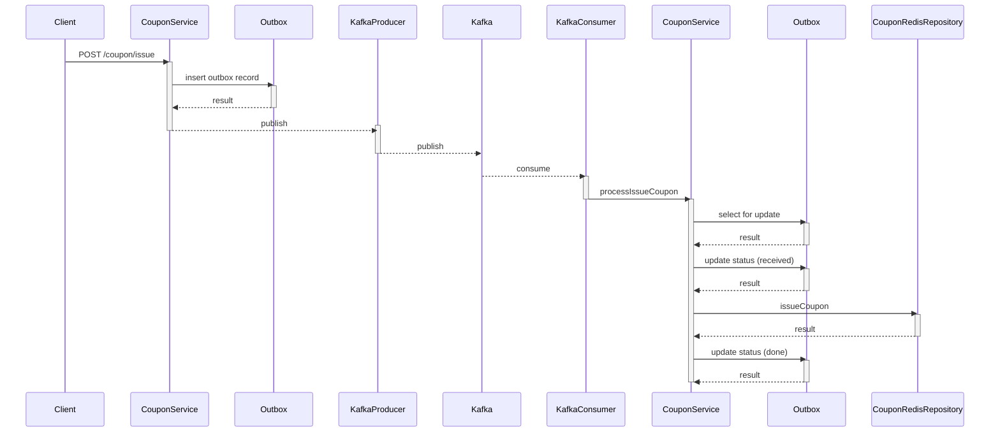

# STEP18 쿠폰 발급 프로세스 내 Kafka 도입 설계 문서

## 1. 목적

기존 Redis Sorted Set 기반 대기열 처리에서 Kafka 기반 메시지 발행 방식으로 전환하는 목적은 처리의 신뢰성, 확장성, 관측 가능성을 강화하기 위함입니다.

### 1-1. 내결함성 (Fault Tolerance) 강화

- Redis 기반 대기열은 단일 인메모리 시스템에 의존하므로, 서버 재시작이나 장애 발생 시 데이터 유실 가능성이 있음
- Kafka 는 디스크 기반 저장 + 복제 기능으로 메시지 내구성(durability)을 보장함
- Outbox Pattern 을 결합하면 메시지 유실 없이 복구 가능

### 1-2. 비동기 처리의 신뢰성 및 추적성 확보

- Redis 에서는 처리 여부나 실패에 대한 상태 추적이 불명확함
- Kafka + Outbox 를 사용하면 init → received → done 등의 상태 추적이 가능하여 정확한 이벤트 흐름 모니터링이 가능
- 장애 발생 시에도 init 상태 메시지를 재시도할 수 있음 (retry loop)

### 1-3. 스케일아웃(Scale-out)에 유리

- Redis 기반 대기열 처리에서는 단일 스케줄러가 순차 처리해야 하므로 확장성이 제한적
- Kafka 는 파티션을 기반으로 Consumer Group 을 구성해 병렬 분산처리가 가능함
→ 서비스 부하 증가 시에도 손쉽게 Consumer 수평 확장 가능

### 1-4. 처리 관측성(Observability) 향상

- Kafka 는 메시지 offset 기반으로 어떤 메시지가 소비됐는지 로그로 추적 가능
- 모니터링 도구 (e.g. Kafka UI, Grafana + Prometheus) 를 통한 가시성 확보

### 1-5. 재처리 / 리플레이 지원

- Redis 는 과거 데이터를 쉽게 리플레이하기 어렵고 TTL로 사라질 수 있음
- Kafka는 keep-alive된 로그 기반으로 특정 시점부터 재처리 가능
→ init 상태만 필터링해서 재전송도 가능

## 2. 방법

Kafka 기반 비동기 메시징 시스템에서 메시지의 발행, 소비, 상태 추적(Outbox), 그리고 재처리 로직을 구현하기 위한 전략을 설명합니다.

주요 기능:

- Kafka 메시지 발행
- Outbox 테이블 기록을 통한 메시지 추적
- Kafka Consumer 처리 후 상태 변경
- 처리 실패/누락 메시지의 재전송 (Retry)

### 2-1. Outbox 테이블 정의

메시지 상태를 추적할 수 있는 Outbox 테이블을 정의합니다.

```tsx
// schema.prisma
model Outbox {
  id        Int           @id @default(autoincrement())
  topic     String
  key       String
  value     Json
  status    OutboxStatus  @default(init)
  createdAt DateTime      @default(now())
  updatedAt DateTime      @updatedAt
}

enum OutboxStatus {
  init       // 메시지 준비 완료 (트랜잭션 내 작성됨)
  received   // 컨슈머가 수신 후 처리 중
  done       // 처리 완료
}
```

### 2-2. 메시지 발행

메시지 발행 시 DB 트랜잭션 내 Outbox에 먼저 기록하고, 트랜잭션이 완료되면 Kafka로 메시지를 발행합니다.

```tsx
  async requestIssueCoupon(command: IssueCouponCommand, txc?: Prisma.TransactionClient): Promise<void> {
    const couponId = command.couponId;
    const memberId = command.memberId;

    const topic = 'issue.coupon.requested';
    const key = couponId.toString();

    let outboxId: number= -1;
    await this.transactionService.executeInTransaction(async (tx) => {
      const client = txc ?? tx;

      const result = await client.outbox.create({
        data: {
          topic,
          key,
          value: { couponId, memberId },
          status: 'init', // enum 생략 가능
        },
      });
      outboxId = result.id;
    });

    const value = JSON.stringify(new IssueCouponRequstedEvent(outboxId, couponId, memberId));
    this.kafkaPublisher.publish({ topic, key, value })

    return;
  }
```

### 2-3. 메시지 소비

Kafka Consumer는 메시지를 수신하면 해당 outboxId를 기반으로 상태를 관리 및 비즈니스 로직을 수행합니다.

```tsx
  async processIssueCoupon(outboxId: number, couponId: number, memberId: number): Promise<void> {
    return await this.transactionService.executeInTransaction(async (tx) => {
      const client = tx;

      try {
        const outboxStatus = await client.$queryRawUnsafe(
          `SELECT status FROM Outbox WHERE id = ${outboxId} FOR UPDATE`
        )

        if(outboxStatus[0].status != 'init') return;

        await client.outbox.update({
          where: { id: outboxId },
          data: {
            status: 'received'
          }
        });

        const isSuccessed = await this.couponRedisRepoistory.issueCoupon(couponId, memberId);

        await client.outbox.update({
          where: { id: outboxId },
          data: {
            status: 'done'
          }
        });

      } catch (error) {
        if(error instanceof HttpException || error instanceof PrismaClientKnownRequestError) {
          throw error;
        } else {
          throw new Error("쿠폰 발급 중 예기치 못한 문제가 발생하였습니다. 관리자에게 문의해주세요.")
        }
      }
    });
  }
```

### 2-4. 메시지 재처리

5분 이상 init 상태로 남아있는 메시지를 주기적으로 재발행합니다.

```tsx
  @Interval(5000)
  async retryUnpublishedMessages() {
    const fiveMinutesAgo = subMinutes(new Date(), 5);

    await this.transactionService.executeInTransaction(async (tx) => {
      const client = tx;

      const outboxEvents = await client.outbox.findMany({
        where: {
          status: 'init',
          createdAt: { lte: fiveMinutesAgo },
        },
        take: 10,
        orderBy: { createdAt: 'asc' },
      });

      for (const event of outboxEvents) {
        try {
          let eventObject: any;
          const parsedValue = typeof event.value === 'string'
            ? JSON.parse(event.value)
            : event.value;

          switch (event.topic) {
            case 'issue.coupon.requested':
              eventObject = new IssueCouponRequstedEvent(event.id, parsedValue.couponId, parsedValue.memberId);
              break;

            default:
              eventObject = { outboxId: event.id, ...parsedValue };
          }

          await this.kafkaPublisher.publish({
            topic: event.topic,
            key: event.key,
            value: JSON.stringify(eventObject),
          });
        } catch (error) {
          console.error(`재발행 실패 (id: ${event.id}):`, error)
        }
      }
    });
  }
```

## 3. 설계 (시퀀스 다이어그램)



### 처리 흐름:

1. 사용자 요청
    - Client 가 Post /coupon/issue API 를 호출하여 쿠폰 발급을 요청합니다.
    - 요청은 CouponService 로 전달됩니다.
2. Outbox에 메시지 기록 (트랜잭션 내)
    - CouponService 는 Outbox 테이블에 발급 요청 이벤트를 기록합니다.
    - Outbox 테이블은 insert 요청에 대해 성공 응답을 반환합니다.
3. Kafka로 메시지 발행
    - CouponService 는 Kafka Producer 를 통해 Kafka 에 메시지를 직렬화된 JSON 형태로 발행합니다.
    - KafkaProducer 는 메시지를 Kafka 브로커에게 전송합니다.
4. Kafka 메시지 소비
    - Kafka 는 해당 메시지를 구독 중인 KafkaConsumer 에게 전달합니다.
    - KafkaConsumer 는 메시지를 수신하면 ConponService 에 메시지 처리를 요청합니다.
5. 이벤트 처리 시작
    - ConponService 는 수신한 메시지에서 outboxId 를 추출하여, 해당 레코드에 비관적 락을 할당받습니다.
    - 상태가 init 인 경우에만 다음 처리를 진행합니다.
6. Outbox 상태 업데이트 - received
    - 상태가 유효하면, Outbox의 해당 레코드 상태를 received 로 변경하여 처리 중임을 명시합니다.
7. Redis에 쿠폰 발급 기록
    - 이후 CouponRedisRepository 를 호출하여 Redis 기반 쿠폰 발급을 수행합니다.
    - Redis 는 발급 성공 여부를 반환합니다.
8. Outbox 상태 업데이트 - done
    - 쿠폰 발급이 성공적으로 끝나면, Outbox 테이블의 해당 레코드를 done 상태로 업데이트합니다.

## 4. 결론: Kafka + Outbox 기반 쿠폰 발급 시스템의 핵심 가치

이번 아키텍처는 단순한 메시지 발행 시스템이 아닌, 신뢰성 있는 이벤트 기반 처리를 보장하는 구조입니다.
Kafka, Outbox 패턴, Redis 를 조합한 이 설계는 다음과 같은 장점을 제공합니다.

### 4-1. 데이터 유실 없는 안정성 확보

- 이벤트는 Outbox 테이블에 DB 트랜잭션과 함께 저장되어, Kafka 로 발행되지 않더라도 메시지를 유실하지 않음
- Kafka 메시지가 발행되었는지 여부와 상태(init, received, done)를 명확하게 추적 가능

### 4-2. 멱등성과 중복 방지

- SELECT FOR UPDATE 를 통한 비관적 락과 상태 기반 처리로 중복 소비(duplicate processing) 방지
- 한 메시지가 여러 번 발행되어도 실제 쿠폰 지급은 정확히 한 번만 실행

### 4-3. 재처리 및 복구 메커니즘 내장

- 일정 시간 이상 init 상태로 남아있는 메시지를 자동으로 재발행
- 장애 상황에서도 신속하게 복구 가능한 구조

### 4-4. 확장성과 유연한 연동

- Kafka 기반이기 때문에 Consumer 수평 확장, 다양한 이베늩 소비자 구성, 3rd-party 연동에 유리
- 내부 마이크로서비스 뿐 아니라 외부 시스템과의 연동도 동일한 방식으로 일관성 유지 가능

### 4-5. 통합 테스트의 가시성

- TestContainer 기반의 Kafka 테스트 환경에서 Producer-Consumer-로직 처리까지 엔드 투 엔드로 검증 가능
- Outbox 테이블을 통해 처리 흐름을 눈에 보이는 데이터로 추적 가능

### 결론 요약

> Kafka + Outbox + Redis 구조는 단순한 메시지 전송이 아니라, 비동기 이벤트 처리의 신뢰성, 추적성, 복구 가능성을 모두 갖춘 고도화된 이벤트 처리 시스템입니다.
이러한 구조를 통해 비즈니스 이벤트의 안정적인 흐름을 보장하고, 장애 상황에서도 회복 가능한 탄탄한 기반을 구축할 수 있습니다.
>