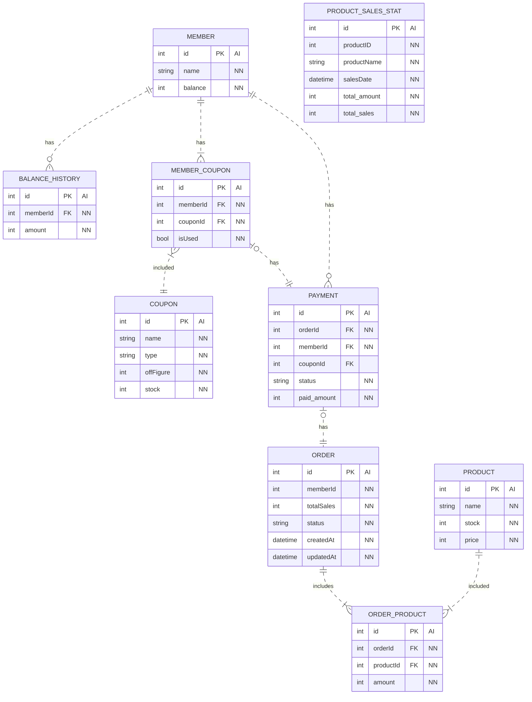

# ERD

```mermaid
erDiagram
    MEMBER ||..o{ BALANCE_HISTORY : has
    MEMBER_COUPON }|..|| COUPON : included
    MEMBER ||..|{ MEMBER_COUPON : has
    MEMBER ||..o{ PAYMENT : has
    MEMBER_COUPON |o..|| PAYMENT : has
    PAYMENT |o..|| ORDER : has
    ORDER ||..|{ ORDER_PRODUCT : includes
    PRODUCT ||..|{ ORDER_PRODUCT : included
    
    MEMBER {
        int id PK "AI"
        string name "NN"
        int balance "NN"
    }
    BALANCE_HISTORY {
        int id PK "AI"
        int memberId FK "NN"
        int amount "NN"
    }
    MEMBER_COUPON {
        int id PK "AI"
        int memberId FK "NN"
        int couponId FK "NN"
        bool isUsed "NN"
    }
    COUPON {
        int id PK "AI"
        string name "NN"
        string type "NN"
        int offFigure "NN"
        int stock "NN"
    }
    PAYMENT {
        int id PK "AI"
        int orderId FK "NN"
        int memberId FK "NN"
        int couponId FK
        string status "NN"
        int paid_amount "NN"
    }
    ORDER {
        int id PK "AI"
        int memberId "NN"
        int totalSales "NN"
        string status "NN"
        datetime createdAt "NN"
        datetime updatedAt "NN"
    }
    ORDER_PRODUCT {
        int id PK "AI"
        int orderId FK "NN"
        int productId FK "NN"
        int amount "NN"
    }
    PRODUCT {
        int id PK "AI"
        string name "NN"
        int stock "NN"
        int price "NN"
    }
    PRODUCT_SALES_STAT {
        int id PK "AI"
        int productID "NN"
        string productName "NN"
        datetime salesDate "NN"
        int total_amount "NN"
        int total_sales "NN"
    }
```